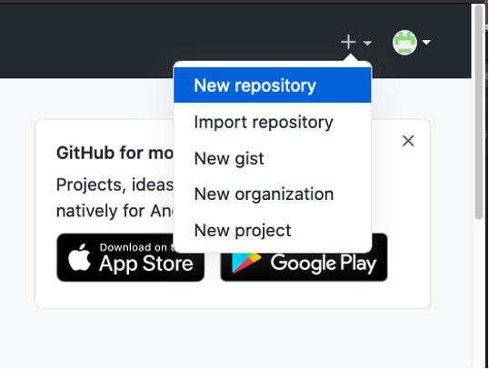
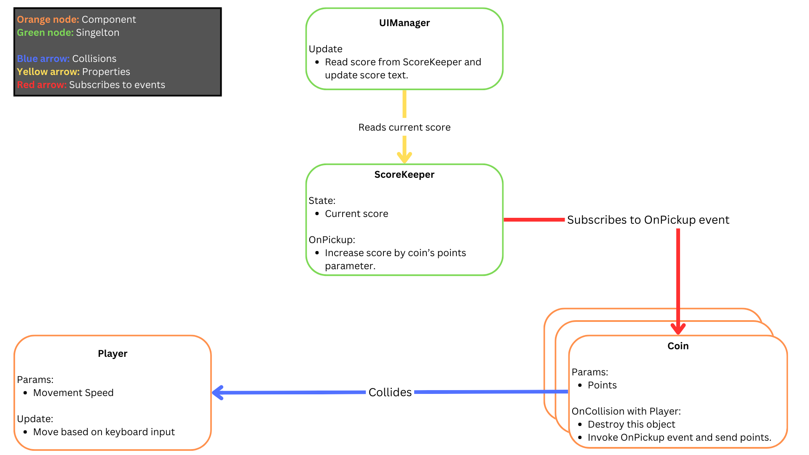
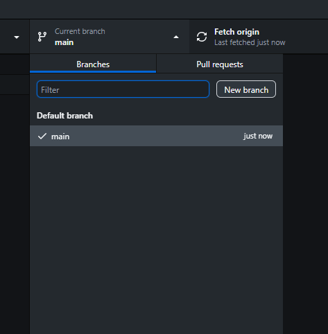
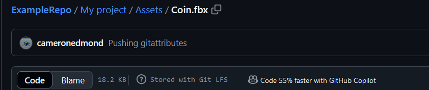

# COMP2160 Game Development - Prac Week 8

## Topics covered:
* Version control
* Task delegation

> ## Discussion: Real world examples
>So far, we've mainly discussed ethical issues in the abstract. For this week, your group will be assigned a case study with an accompanying news article or press release. Your job is to analyse this case study, applying what you've learnt from the ethics content in this unit to a real world scenario.
>
> Case studies:
> * Space Ape Going Carbon Neutral: https://spaceapegames.com/green
> * Capcom Data Hack: https://cyberscoop.com/capcom-ransomware-data-breach-ragnar-locker/
> * Cult of The Lamb and Unity: https://www.ign.com/articles/cult-of-the-lamb-developer-threatens-to-delete-game-on-jan-1-amid-unity-backlash
> * Chucklefish and Unpaid Devs: https://screenrant.com/starbound-chucklefish-unpaid-developer-accusation/
> * Don't Nod's use of GenAI: https://www.gamedeveloper.com/production/why-don-t-nod-will-probably-be-the-last-studio-to-adopt-ai
> 
> For your scenario, discuss the following:
> * What are the ethical issues/topics at play here?
> * What are the different perspectives? How might the ACS or other frameworks be violated or upheld?
> * Try to see it from the "other side" - if the company is acting incorrectly, why? What considerations are they balancing? If you think they are doing the right thing, what are the potential downsides of their approach? No solution is perfect!
> * Do you know of any similar scenarios where a company has made a different decision?

## Today's Task
In this prac you will be working with a partner to practice team-based version control in Git. You will need to find someone else to work with on this task.

For the rest of this prac, we will refer to you and your partner as <b>Dev A</b> and <b>Dev B</b>. Decide between each other who is who. Tasks are labelled with the person in charge of them.

Note: If you are working on the lab computers, you are likely working with Github Desktop or GitKraken. However, you can use whatever Git Client you are comfortable with. This prac sheet assumes you are using Github Desktop.

### Step 1 – Set up a project
<b>Dev A</b> 
Log into the GitHub website and create a new repository. Remember to give it a meaningful name:

 

After you’ve created the repository, on the Settings > Collaborators page, add your partner Dev B as a collaborator.

<b>Dev B</b> 
Clone and check out the repo onto your local machine. Create a Unity project in the repo folder (don’t commit this yet!).

Download this [.gitignore file](https://github.com/github/gitignore/blob/main/Unity.gitignore) and copy it into the Unity project folder, renaming it to “.gitignore” (note the dot at the beginning). Make sure you name the file ".gitignore" and not ".gitignore.gitignore". Turn on File Name Extensions in File Explorer to check.

> Note: This file will only work when placed inside your Unity project. This will also mean that Github Desktop won't recognise it as a gitignore. If you'd like to place it at your repo's top level, you will need to place an '*' at the start of each line (e.g. `*/[Ll]ibrary/`).

Commit and push the Unity project. Check that the Library and Temp files are not being committed.

<b>Dev A</b> 
Clone and check out the repo on a different machine. Is the Unity project there?

### Step 2 – Assign tasks and branch the repo 
Your goal is to make a simple 3D game with the following mechanics (keep it as simple as possible, using Unity primitives for your models):
* There is a player avatar that moves in the scene.
* There are coins which you pick up to get points.
* There is a scoring UI to show how many coins you have picked up.

The ERD should look like this:

Divide the workload between team members (but don’t get started on the work yet!):
* Dev A is responsible for the ScoreKeeper and UI Manager.
* Dev B is responsible for the Player and Coin.

Create separate development branches for each developer, and make sure to give them meaningful names. If you are using Github Desktop, you can make a new branch by clicking Current Branch > New Branch.

Remember to Publish your branch before adding any code or assets by clicking the "Publish Branch" button in Github Desktop, or its equivalent in whatever tool you are using.

### Step 3 – Create a scene & prefabs
Having multiple developers working on the same scene can be a common cause of merge conflicts which are difficult to resolve. You can avoid this by separating the elements of the scene into individual prefabs.

<b>Dev B</b> 
Make a Main scene containing:
* A player 
* A collection of coin objects grouped under an empty transform
* A ScoreKeeper
* A UI Canvas

Convert each of these elements into prefabs. When coding, make changes to the prefabs rather than to the scene. You can open the prefab in the Scene panel by double-clicking on it in your Project panel.

Commit and push your work to your branch. Merge your changes it into the main branch by switching to the main branch and then clicking "Choose a Branch to Merge into Main" from the bottom of the branch list in Github Desktop.

<b>Dev A</b> 
Merge the main branch with these changes into your development branch by clicking "Choose a Branch to Merge into [YOUR BRANCH NAME]" from the bottom of the branch list in Github Desktop.

>NOTE: Normally, we would use Pull Requests for our merges. However, we are not doing that in this task as using pull requests for the GDT2 assignment can very easily result in pull requests to the template repo. So, for this unit, please pretend Pull Requests don't exist. :)

### Step 4 – Implement the ScoreKeeper
We will start by implementing the ScoreKeeper, since it is the element that joins the two halves.

<b>Both Devs</b> 
Following the ERD, work out what the public interface of the ScoreKeeper needs to be. Does it need any public methods or properties?

<b>Dev A</b> 
Implement the ScoreKeeper. Commit and push your work to your branch.

<b>Dev B</b> 
Do a code review for A’s work, following the C# Style Guide. Here are some general rules for code review:
* Focus on things that might break or hinder the project, not just something you'd do differently.
* Code reviews should NEVER be done by the original coder.

Are there any issues that could be fixed? Report these to Dev A, and make sure they are noted down to show your demonstrator later.

<b>Dev A</b> 
Fix any issues arising from the review. Merge your code into the main branch.

<b>Dev B</b> 
Merge the main branch (with the ScoreKeeper) into your development branch.

## Git LFS
We have provided you a model to use for your coins. It can be found under the "Resources" section of Week 8 on iLearn. Download the coin mesh from iLearn and place it inside your assets folder. You'll be using this later to create your coin object.

The coin model is a .FBX file. This is a binary file, and so we don't want to store this using Github's normal version control system. Github provides Git LFS, or Git Large File Storage, which we can use to store this and other similar files.

Copy the .gitattributes file from iLearn and place it inside your repository. It can be found under the "Resources" section of Week 8 on iLearn. If you already have a .gitattributes file, copy the text from the iLearn file into it.

Much like .gitignore file removes certain files from your version control completely, Git LFS places them (models, images, sound, etc) into a seperate form of storage. There is a limit on this, so don't think this gives you license to import whatever you want.

With the coin model and the .gitattributes file in your project, save, commit and push your work to your branch. Check that the coin model is being correctly stored by navigating to it on Github (make sure you are on your branch) and looking for the "Stored with Git LFS" note. You should see something like this:

If all is good, merge your changes into the main branch.

<b>Deb A</b> 
Merge the changes in the main branch into your branch.

### To receive half marks, show your tutor:
* Your .gitignore file.
* Your different branches.
* Your coin mesh being properly stored using Git LFS.
* Any changes that emerged from code review.

### Step 5 – Complete your tasks
Each developer should then complete their part of the project working in their personal development branch. As features are completed, conduct a code review, and then merge the code into the main branch. When complete,
tag this build of the game as “Version 1”.

### Step 6: Add a second player
Add a second player to the scene, controlled by different inputs. Display separate scores for each player.
* Discuss what changes are necessary to each of the elements in the ERD.
* Divide up the work between your pair.
* Make the necessary changes in each of your components, in separate development branches.
* Merge the changes into the main branch. Tag this build as “Version 2”. Make sure to document your commits properly so you can show your tutor later.

### To receive full marks, show/tell your tutor:
* Your updated ERD.
* Your task delegation for making the second player.
* Your completed "Version 2", both in Github and in Unity.

